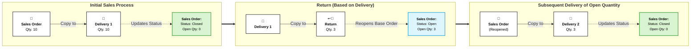

```mermaid
flowchart LR
    %% Estilos de los estados de la orden
    classDef closedStatus fill:#D7F3D0,stroke:#5BAA4F,stroke-width:2px,color:#000000,font-size:12px;
    classDef openStatus fill:#DDF6FD,stroke:#3BAFD8,stroke-width:2px,color:#000000,font-size:12px;
    classDef stepNode fill:#FFFFFF,stroke:#333333,stroke-width:1.5px,color:#000000,font-size:13px;

    %% ----------------------------------------------------
    %% PASO 1: Initial Sales Process
    %% ----------------------------------------------------
    subgraph S1 ["<b>Initial Sales Process</b>"]
        direction LR
        SO1["🛒<br/><b>Sales Order</b><br/>Qty. 10"]:::stepNode
        D1["🚚<br/><b>Delivery 1</b><br/>Qty. 10"]:::stepNode
        ST1["<b>Sales Order:</b><br/>Status: Closed<br/>Open Qty: 0"]:::closedStatus

        SO1 -->|Copy to| D1
        D1 -.->|Updates Status| ST1
    end

    %% ----------------------------------------------------
    %% PASO 2: Return (Based on Delivery)
    %% ----------------------------------------------------
    subgraph S2 ["<b>Return (Based on Delivery)</b>"]
        direction LR
        D1_REF["🚚<br/><b>Delivery 1</b>"]:::stepNode
        RET["↩️🚚<br/><b>Return</b><br/>Qty. 3"]:::stepNode
        ST2["<b>Sales Order:</b><br/>Status: Open<br/>Open Qty: 3"]:::openStatus

        D1_REF -->|Copy to| RET
        RET -.->|Reopens Base Order| ST2
    end

    %% ----------------------------------------------------
    %% PASO 3: Subsequent Delivery of Open Quantity
    %% ----------------------------------------------------
    subgraph S3 ["<b>Subsequent Delivery of Open Quantity</b>"]
        direction LR
        SO2["🛒<br/><b>Sales Order</b><br/>(Reopened)"]:::stepNode
        D2["🚚<br/><b>Delivery 2</b><br/>Qty. 3"]:::stepNode
        ST3["<b>Sales Order:</b><br/>Status: Closed<br/>Open Qty: 0"]:::closedStatus

        SO2 -->|Copy to| D2
        D2 -.->|Updates Status| ST3
    end

    %% Conexión lógica entre fases del proceso
    S1 ==> S2 ==> S3
```
