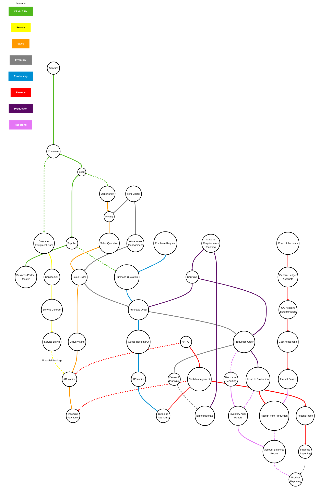

# ERP_182044

```mermaid
%%{init: {
  "theme": "base",
  "themeVariables": {
    "fontFamily": "Arial, Helvetica, sans-serif",
    "fontSize": "14px",
    "primaryColor": "#FFFFFF",
    "primaryTextColor": "#111111",
    "primaryBorderColor": "#000000",
    "lineColor": "#000000",
    "clusterBkg": "#FFFFFF",
    "clusterBorder": "transparent"
  },
  "flowchart": {
    "curve": "basis",
    "htmlLabels": true,
    "nodeSpacing": 40,
    "rankSpacing": 55
  }
}}%%

flowchart TB

  %% =========================
  %% PROCESS NODES
  %% =========================
  ACT((Activities))
  CUST((Customer))
  LEAD((Lead))
  SUP((Supplier))
  BPM((Business Partner<br/>Master))

  OPP((Opportunity))
  PRI((Pricing))
  SQ((Sales Quotation))
  SO((Sales Order))
  DN((Delivery Note))
  AR((AR Invoice))
  IP((Incoming<br/>Payments))

  CEC((Customer<br/>Equipment Card))
  SC((Service Call))
  SCT((Service Contract))
  SB((Service Billing))

  IM((Item Master))
  WM((Warehouse<br/>Management))
  PR((Purchase Request))
  PQ((Purchase Quotation))
  PO((Purchase Order))
  GRPO((Goods Receipt PO))
  AP((AP Invoice))
  OP((Outgoing<br/>Payments))
  DP((Demand<br/>Planning))

  SRC((Sourcing))
  MRP((Material<br/>Requirements<br/>Planning))
  BOM((Bill of Materials))

  PROD((Production Order))
  ITP((Issue to Production))
  RFP((Receipt from Production))

  APAR((AP / AR))
  CM((Cash Management))
  REC((Reconciliation))
  FR((Financial<br/>Reporting))
  COA((Chart of Accounts))
  GLA((General Ledger<br/>Accounts))
  GLAD((G/L Account<br/>Determination))
  CA((Cost Accounting))
  JE((Journal Entries))

  BR((Backorder<br/>Reporting))
  IAR((Inventory Audit<br/>Report))
  ABR((Account Balances<br/>Report))
  PRPT((Product<br/>Reporting))

  %% =========================
  %% CRM / SRM — GREEN
  %% =========================
  ACT --> CUST
  CUST --> LEAD
  LEAD --> SUP
  SUP --> BPM
  CUST -.-> CEC
  LEAD -.-> OPP
  SUP -.-> PQ

  %% =========================
  %% SERVICE — YELLOW
  %% =========================
  CEC --> SC
  SC --> SCT
  SCT --> SB
  SB -. "Financial Postings" .-> AR

  %% =========================
  %% SALES — ORANGE
  %% =========================
  OPP --> PRI
  PRI --> SQ
  SQ --> SO
  SO --> DN
  DN --> AR
  AR --> IP

  %% =========================
  %% INVENTORY — GRAY
  %% =========================
  IM --> WM
  WM --> SO
  SO --> PO
  PO --> PROD
  PROD --> DP
  IM --> PRI
  DP -.-> BOM

  %% =========================
  %% PURCHASING — BLUE
  %% =========================
  PR --> PQ
  PQ --> PO
  PO --> GRPO
  GRPO --> AP
  AP --> OP
  SRC --> PO

  %% =========================
  %% PRODUCTION — PURPLE
  %% =========================
  MRP --> SRC
  MRP --> BOM
  SRC --> PROD
  PROD --> ITP
  ITP --> RFP

  %% =========================
  %% FINANCE — RED
  %% =========================
  APAR --> CM
  CM --> REC
  REC --> FR
  APAR --> AR
  CM -.-> IP
  CM -.-> OP
  COA --> GLA
  GLA --> GLAD
  GLAD --> CA
  CA --> JE
  JE --> RFP

  %% =========================
  %% REPORTING — MAGENTA
  %% =========================
  BR --> IAR
  IAR --> ABR
  ABR --> PRPT
  PROD -.-> BR
  ITP -.-> IAR
  RFP -.-> ABR
  FR --> PRPT

  %% =========================
  %% NODE STYLE — círculos blancos con borde negro
  %% =========================
  classDef process fill:#FFFFFF,stroke:#000000,stroke-width:3px,color:#111111;
  class ACT,CUST,LEAD,SUP,BPM,OPP,PRI,SQ,SO,DN,AR,IP,CEC,SC,SCT,SB,IM,WM,PR,PQ,PO,GRPO,AP,OP,DP,SRC,MRP,BOM,PROD,ITP,RFP,APAR,CM,REC,FR,COA,GLA,GLAD,CA,JE,BR,IAR,ABR,PRPT process;

  %% =========================
  %% LEGEND — mismos colores de la imagen
  %% =========================
  subgraph LEGEND["Leyenda"]
    direction LR
    LCRM["CRM / SRM"]
    LSVC["Service"]
    LSALE["Sales"]
    LINV["Inventory"]
    LPUR["Purchasing"]
    LFIN["Finance"]
    LPROD["Production"]
    LREP["Reporting"]
  end

  style LEGEND fill:#FFFFFF,stroke:#FFFFFF,color:#111111
  style LCRM fill:#4FB81C,stroke:#4FB81C,color:#FFFFFF,font-weight:bold
  style LSVC fill:#FFFF00,stroke:#FFFF00,color:#111111,font-weight:bold
  style LSALE fill:#FF9900,stroke:#FF9900,color:#FFFFFF,font-weight:bold
  style LINV fill:#808080,stroke:#808080,color:#FFFFFF,font-weight:bold
  style LPUR fill:#008FD3,stroke:#008FD3,color:#FFFFFF,font-weight:bold
  style LFIN fill:#FF0000,stroke:#FF0000,color:#FFFFFF,font-weight:bold
  style LPROD fill:#590864,stroke:#590864,color:#FFFFFF,font-weight:bold
  style LREP fill:#E576F5,stroke:#E576F5,color:#FFFFFF,font-weight:bold

  %% =========================
  %% EDGE COLORS — índices según el orden de aparición arriba
  %% =========================
  %% Green: 0-6
  linkStyle 0,1,2,3 stroke:#4FB81C,stroke-width:4px
  linkStyle 4,5,6 stroke:#4FB81C,stroke-width:4px,stroke-dasharray:8 6

  %% Yellow: 7-10
  linkStyle 7,8,9 stroke:#FFFF00,stroke-width:4px
  linkStyle 10 stroke:#FFFF00,stroke-width:4px,stroke-dasharray:10 7

  %% Orange: 11-16
  linkStyle 11,12,13,14,15,16 stroke:#FF9900,stroke-width:4px

  %% Gray: 17-23
  linkStyle 17,18,19,20,21,22 stroke:#808080,stroke-width:4px
  linkStyle 23 stroke:#808080,stroke-width:4px,stroke-dasharray:8 6

  %% Blue: 24-28
  linkStyle 24,25,26,27,28 stroke:#008FD3,stroke-width:4px

  %% Purple: 29-33
  linkStyle 29,30,31,32,33 stroke:#590864,stroke-width:4px

  %% Red: 34-44
  linkStyle 34,35,36,37,41,42,43,44 stroke:#FF0000,stroke-width:4px
  linkStyle 38,39 stroke:#FF0000,stroke-width:4px,stroke-dasharray:5 5
  linkStyle 40 stroke:#FF0000,stroke-width:4px

  %% Magenta: 45-51
  linkStyle 45,46,47,51 stroke:#E576F5,stroke-width:4px
  linkStyle 48,49,50 stroke:#E576F5,stroke-width:4px,stroke-dasharray:8 6
```
