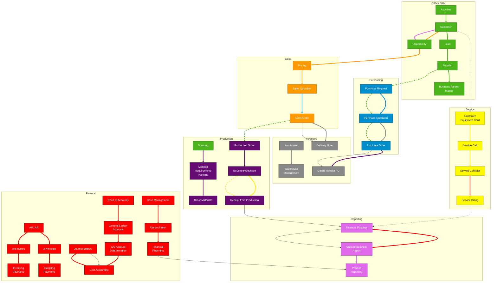

# ERP_182044

```mermaid
flowchart TB

%% ============================================================
%% CRM / SRM
%% ============================================================

subgraph CRM["CRM / SRM"]
direction TB

A["Activities"]
C["Customer"]
L["Lead"]
S["Supplier"]
BPM["Business Partner<br/>Master"]

A --> C --> L --> S --> BPM

O["Opportunity"]

C --> O
end


%% ============================================================
%% SALES
%% ============================================================

subgraph SALES["Sales"]
direction TB

PRIC["Pricing"]
SQ["Sales Quotation"]
SO["Sales Order"]

O --> PRIC --> SQ --> SO
end


%% ============================================================
%% PURCHASING
%% ============================================================

subgraph PURCH["Purchasing"]
direction TB

PREQ["Purchase Request"]
PQUO["Purchase Quotation"]
PO["Purchase Order"]

PREQ --> PQUO --> PO
end


%% ============================================================
%% INVENTORY
%% ============================================================

subgraph INV["Inventory"]
direction TB

IM["Item Master"]
WM["Warehouse<br/>Management"]
DN["Delivery Note"]
GRPO["Goods Receipt PO"]

IM --> WM
SO --> DN
PO --> GRPO
end


%% ============================================================
%% PRODUCTION
%% ============================================================

subgraph PROD["Production"]
direction TB

SRC["Sourcing"]
MRP["Material<br/>Requirements<br/>Planning"]
BOM["Bill of Materials"]

PP["Production Order"]
IP["Issue to Production"]
RFP["Receipt from Production"]

SRC --> MRP --> BOM
PP --> IP --> RFP
end


%% ============================================================
%% SERVICE
%% ============================================================

subgraph SERV["Service"]
direction TB

CEC["Customer<br/>Equipment Card"]
SC["Service Call"]
SCT["Service Contract"]
SB["Service Billing"]

CEC --> SC --> SCT --> SB
end


%% ============================================================
%% FINANCE
%% ============================================================

subgraph FIN["Finance"]
direction TB

APAR["AP / AR"]
AR["AR Invoice"]
IN["Incoming<br/>Payments"]

AP["AP Invoice"]
OUT["Outgoing<br/>Payments"]

CM["Cash Management"]
REC["Reconciliation"]
FR["Financial<br/>Reporting"]

JE["Journal Entries"]
CA["Cost Accounting"]
GLAD["G/L Account<br/>Determination"]
GL["General Ledger<br/>Accounts"]
COA["Chart of Accounts"]

APAR --> AR --> IN
APAR --> AP --> OUT

CM --> REC --> FR

COA --> GL --> GLAD --> CA --> JE
end


%% ============================================================
%% REPORTING
%% ============================================================

subgraph REP["Reporting"]
direction TB

FP["Financial Postings"]
AB["Account Balances<br/>Report"]
PR["Product<br/>Reporting"]

FP --> AB --> PR
end


%% ============================================================
%% CONEXIONES REALES ENTRE ÁREAS
%% ============================================================

%% CRM / SRM → Sales
C --> O

%% CRM / SRM → Service
C -.-> CEC

%% CRM / SRM → Purchasing
S -.-> PREQ

%% Purchasing
PREQ --> PQUO --> PO

%% Sales → Inventory
SO --> DN

%% Purchasing → Inventory
PO --> GRPO

%% Sales → Production
SO --> PP

%% Production → Inventory
IP --> RFP

%% Production → Finance
JE --> CA

%% Service → Finance
SB -.-> FP

%% Inventory → Finance
RFP --> FP

%% Finance → Reporting
FR --> PR

%% Finance reporting
FP --> AB

%% ============================================================
%% COLORES
%% ============================================================

classDef crm fill:#4BB51B,color:white,stroke:#2F850E,stroke-width:2px;
classDef service fill:#FFF900,color:#111,stroke:#C8C000,stroke-width:2px;
classDef sales fill:#FF9900,color:white,stroke:#D47700,stroke-width:2px;
classDef inventory fill:#888888,color:white,stroke:#666666,stroke-width:2px;
classDef purchasing fill:#008DCC,color:white,stroke:#006A99,stroke-width:2px;
classDef finance fill:#FF0000,color:white,stroke:#B00000,stroke-width:2px;
classDef production fill:#650B72,color:white,stroke:#45064E,stroke-width:2px;
classDef reporting fill:#E06BEA,color:white,stroke:#B84CC4,stroke-width:2px;

class A,C,L,S,BPM,O,SRC crm;

class CEC,SC,SCT,SB service;

class PRIC,SQ,SO sales;

class IM,WM,DN,GRPO inventory;

class PREQ,PQUO,PO purchasing;

class APAR,AR,IN,AP,OUT,CM,REC,FR,JE,CA,GLAD,GL,COA finance;

class MRP,BOM,PP,IP,RFP production;

class FP,AB,PR reporting;


%% ============================================================
%% ESTILOS DE FLUJO
%% ============================================================

%% CRM
linkStyle 0,1,2,3 stroke:#4BB51B,stroke-width:4px;

%% Sales
linkStyle 4,5,6 stroke:#FF9900,stroke-width:4px;

%% Purchasing
linkStyle 7,8 stroke:#008DCC,stroke-width:4px;

%% Inventory
linkStyle 9,10,11 stroke:#888888,stroke-width:4px;

%% Production
linkStyle 12,13,14,15 stroke:#650B72,stroke-width:4px;

%% Service
linkStyle 16,17,18 stroke:#FFF000,stroke-width:4px;

%% Finance
linkStyle 19,20,21,22,23,24,25,26,27,28,29,30 stroke:#FF0000,stroke-width:4px;

%% Reporting
linkStyle 31,32 stroke:#E06BEA,stroke-width:4px;

%% Conexiones inter-área discontinuas
linkStyle 34,35,36,39 stroke:#4BB51B,stroke-width:3px,stroke-dasharray:8 6;
linkStyle 40 stroke:#FFF000,stroke-width:3px,stroke-dasharray:8 6;
```
