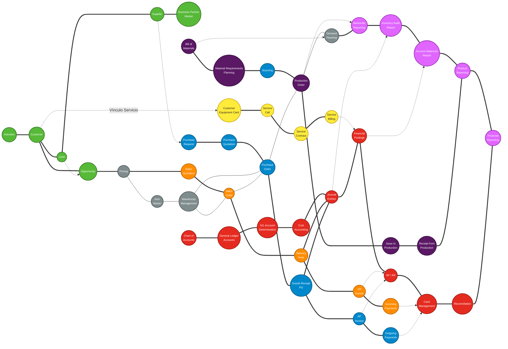

# ERP_182044

```mermaid
flowchart LR
    %% ==========================================
    %% ESTILOS DE COLORES POR MÓDULO (CIRCULARES)
    %% ==========================================
    classDef crm fill:#57B938,stroke:#2e6d1c,stroke-width:2px,color:#FFFFFF,font-size:11px;
    classDef sales fill:#FF8C00,stroke:#b35f00,stroke-width:2px,color:#FFFFFF,font-size:11px;
    classDef purchasing fill:#0088CC,stroke:#005580,stroke-width:2px,color:#FFFFFF,font-size:11px;
    classDef production fill:#5B1865,stroke:#340d3a,stroke-width:2px,color:#FFFFFF,font-size:11px;
    classDef service fill:#FFEB3B,stroke:#c4a000,stroke-width:2px,color:#222222,font-size:11px;
    classDef inventory fill:#7F8C8D,stroke:#485052,stroke-width:2px,color:#FFFFFF,font-size:11px;
    classDef finance fill:#E52B20,stroke:#94160e,stroke-width:2px,color:#FFFFFF,font-size:11px;
    classDef reporting fill:#E066FF,stroke:#8f22ad,stroke-width:2px,color:#FFFFFF,font-size:11px;
    classDef hub fill:#FFFFFF,stroke:#333333,stroke-width:3px,color:#111111,font-size:11px;

    %% ==========================================
    %% 1. CRM / SRM (LÍNEA VERDE)
    %% ==========================================
    ACT((Activities)):::crm
    CUST((Customer)):::crm
    LEAD((Lead)):::crm
    SUPP((Supplier)):::crm
    BPM((Business Partner<br/>Master)):::crm

    ACT === CUST === LEAD === SUPP === BPM

    %% ==========================================
    %% 2. SERVICE (LÍNEA AMARILLA)
    %% ==========================================
    CEC((Customer<br/>Equipment Card)):::service
    SC((Service<br/>Call)):::service
    SCON((Service<br/>Contract)):::service
    SB((Service<br/>Billing)):::service

    CUST -.->|Vínculo Servicio| CEC
    CEC === SC === SCON === SB

    %% ==========================================
    %% 3. SALES (LÍNEA NARANJA)
    %% ==========================================
    OPP((Opportunity)):::crm
    PRIC((Pricing)):::inventory
    SQ((Sales<br/>Quotation)):::sales
    SO((Sales<br/>Order)):::sales
    DN((Delivery<br/>Note)):::sales
    AR_INV((AR<br/>Invoice)):::sales
    IN_PAY((Incoming<br/>Payments)):::sales

    CUST === OPP === PRIC === SQ === SO === DN === AR_INV === IN_PAY
    LEAD -.-> OPP

    %% ==========================================
    %% 4. PURCHASING (LÍNEA AZUL)
    %% ==========================================
    PR((Purchase<br/>Request)):::purchasing
    PQ((Purchase<br/>Quotation)):::purchasing
    PO((Purchase<br/>Order)):::purchasing
    GRPO((Goods Receipt<br/>PO)):::purchasing
    AP_INV((AP<br/>Invoice)):::purchasing
    OUT_PAY((Outgoing<br/>Payments)):::purchasing

    SUPP -.-> PR
    PR === PQ === PO === GRPO === AP_INV === OUT_PAY

    %% ==========================================
    %% 5. PRODUCTION (LÍNEA MORADA)
    %% ==========================================
    BOM((Bill of<br/>Materials)):::production
    MRP((Material Requirements<br/>Planning)):::production
    SRC((Sourcing)):::purchasing
    PROD_ORD((Production<br/>Order)):::production
    ISS_P((Issue to<br/>Production)):::production
    REC_P((Receipt from<br/>Production)):::production

    BOM === MRP === SRC === PROD_ORD === ISS_P === REC_P

    %% ==========================================
    %% 6. INVENTORY (LÍNEA GRIS DE CRUCE)
    %% ==========================================
    ITEM_M((Item<br/>Master)):::inventory
    WM((Warehouse<br/>Management)):::inventory
    DP((Demand<br/>Planning)):::inventory

    PRIC --- ITEM_M --- WM --- SO
    WM --- PO
    SO --- PO --- PROD_ORD --- DP

    %% ==========================================
    %% 7. FINANCE (LÍNEA ROJA)
    %% ==========================================
    COA((Chart of<br/>Accounts)):::finance
    GLA((General Ledger<br/>Accounts)):::finance
    GL_DET((G/L Account<br/>Determination)):::finance
    COST_ACC((Cost<br/>Accounting)):::finance
    JE((Journal<br/>Entries)):::finance
    FIN_POST((Financial<br/>Postings)):::finance
    AP_AR((AP / AR)):::finance
    CASH_MGT((Cash<br/>Management)):::finance
    REC((Reconciliation)):::finance

    BOM -.-> DP
    COA === GLA === GL_DET === COST_ACC === JE
    DN === JE
    GRPO === JE
    SB -.-> FIN_POST
    JE === FIN_POST === AP_AR === CASH_MGT === REC

    %% ==========================================
    %% 8. REPORTING (LÍNEA ROSA)
    %% ==========================================
    BOR((Backorder<br/>Reporting)):::reporting
    IAR((Inventory Audit<br/>Report)):::reporting
    ABR((Account Balances<br/>Report)):::reporting
    PROD_REP((Product<br/>Reporting)):::reporting
    FIN_REP((Financial<br/>Reporting)):::reporting

    PROD_ORD -.-> BOR
    DP === BOR === IAR === ABR === PROD_REP === FIN_REP
    REC === FIN_REP
    REC_P === PROD_REP

    %% Conexiones financieras auxiliares
    AR_INV -.-> AP_AR
    AP_INV -.-> AP_AR
    IN_PAY -.-> CASH_MGT
    OUT_PAY -.-> CASH_MGT
    JE -.-> IAR
    FIN_POST -.-> ABR
```
