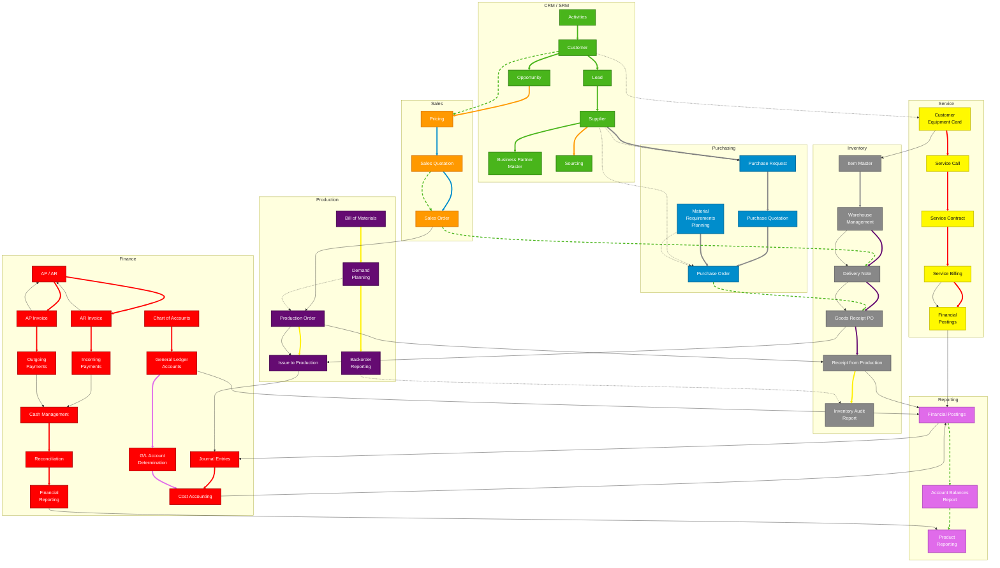

# ERP_182044

```mermaid
flowchart TB

%% =========================================================
%% PROCESOS DE NEGOCIO — VISTA VERTICAL
%% =========================================================

%% ---------- CRM / SRM ----------
subgraph CRM["CRM / SRM"]
direction TB
  ACT["Activities"]
  CUST["Customer"]
  LEAD["Lead"]
  SUP["Supplier"]
  BPM["Business Partner<br/>Master"]
  OPP["Opportunity"]
  SOUR["Sourcing"]

  ACT --> CUST --> LEAD --> SUP --> BPM
  CUST --> OPP
  SUP --> SOUR
end

%% ---------- SALES ----------
subgraph SALES["Sales"]
direction TB
  PRICE["Pricing"]
  SQ["Sales Quotation"]
  SO["Sales Order"]

  OPP --> PRICE --> SQ --> SO
end

%% ---------- PURCHASING ----------
subgraph PURCH["Purchasing"]
direction TB
  PR["Purchase Request"]
  PQ["Purchase Quotation"]
  PO["Purchase Order"]
  MR["Material<br/>Requirements<br/>Planning"]

  PR --> PQ --> PO
  MR --> PO
  SUP --> PR
end

%% ---------- INVENTORY ----------
subgraph INV["Inventory"]
direction TB
  IM["Item Master"]
  WM["Warehouse<br/>Management"]
  DN["Delivery Note"]
  GRPO["Goods Receipt PO"]
  GR["Receipt from Production"]
  IAR["Inventory Audit<br/>Report"]

  IM --> WM --> DN --> GRPO --> GR --> IAR
end

%% ---------- PRODUCTION ----------
subgraph PROD["Production"]
direction TB
  PP["Production Order"]
  IP["Issue to Production"]
  BOM["Bill of Materials"]
  DEM["Demand<br/>Planning"]
  BOR["Backorder<br/>Reporting"]

  BOM --> DEM --> BOR
  PP --> IP
end

%% ---------- SERVICE ----------
subgraph SERVICE["Service"]
direction TB
  CEC["Customer<br/>Equipment Card"]
  SC["Service Call"]
  SCT["Service Contract"]
  SB["Service Billing"]
  FP["Financial<br/>Postings"]

  CEC --> SC --> SCT --> SB --> FP
end

%% ---------- FINANCE ----------
subgraph FIN["Finance"]
direction TB
  APAR["AP / AR"]
  ARINV["AR Invoice"]
  APINV["AP Invoice"]
  INPAY["Incoming<br/>Payments"]
  OUTPAY["Outgoing<br/>Payments"]
  CM["Cash Management"]
  REC["Reconciliation"]
  FR["Financial<br/>Reporting"]
  JE["Journal Entries"]
  CA["Cost Accounting"]
  COA["Chart of Accounts"]
  GL["General Ledger<br/>Accounts"]
  GLAD["G/L Account<br/>Determination"]

  APAR --> ARINV --> INPAY
  APAR --> APINV --> OUTPAY
  CM --> REC --> FR
  JE --> CA
  COA --> GL --> GLAD --> CA
end

%% ---------- REPORTING ----------
subgraph REP["Reporting"]
direction TB
  FPST["Financial Postings"]
  ABR["Account Balances<br/>Report"]
  PRR["Product<br/>Reporting"]

  FPST --> ABR --> PRR
end


%% =========================================================
%% FLUJOS PRINCIPALES
%% =========================================================

CUST --> PRICE
SQ --> SO
SO --> DN

PO --> GRPO
GRPO --> IP
PP --> GR
GR --> FPST

CEC --> IM
WM --> DN
DN --> GRPO

SB --> FP
FP --> FPST

SO --> PP
PP --> IP

IP --> JE
FPST --> JE

ARINV --> APAR
APINV --> APAR

INPAY --> CM
OUTPAY --> CM

%% CRM / SRM relationships
CUST -.-> CEC
SUP -.-> PR
SUP -.-> PO

%% Planning relationships
MR -.-> PO
DEM -.-> PP
BOR -.-> IAR

%% Reporting
CA --> FPST
GL --> FPST
FR --> PRR


%% =========================================================
%% ESTILOS
%% =========================================================

classDef crm fill:#49B51B,color:#fff,stroke:#2d7f0d,stroke-width:2px;
classDef service fill:#FFF900,color:#111,stroke:#c9c000,stroke-width:2px;
classDef sales fill:#FF9900,color:#fff,stroke:#d87500,stroke-width:2px;
classDef inventory fill:#888888,color:#fff,stroke:#666,stroke-width:2px;
classDef purchasing fill:#008DCC,color:#fff,stroke:#006a99,stroke-width:2px;
classDef finance fill:#FF0000,color:#fff,stroke:#b00000,stroke-width:2px;
classDef production fill:#650B72,color:#fff,stroke:#45064e,stroke-width:2px;
classDef reporting fill:#E06BEA,color:#fff,stroke:#b34cbd,stroke-width:2px;

class ACT,CUST,LEAD,SUP,BPM,OPP,SOUR crm;
class CEC,SC,SCT,SB,FP service;
class PRICE,SQ,SO sales;
class IM,WM,DN,GRPO,GR,IAR inventory;
class PR,PQ,PO,MR purchasing;
class APAR,ARINV,APINV,INPAY,OUTPAY,CM,REC,FR,JE,CA,COA,GL,GLAD finance;
class PP,IP,BOM,DEM,BOR production;
class FPST,ABR,PRR reporting;

%% =========================================================
%% COLORES DE CONEXIONES POR FLUJO
%% =========================================================

%% CRM / SRM
linkStyle 0,1,2,3,4 stroke:#49B51B,stroke-width:4px;
%% Sales
linkStyle 5,6 stroke:#FF9900,stroke-width:4px;
%% Purchasing
linkStyle 7,8 stroke:#008DCC,stroke-width:4px;
%% Inventory
linkStyle 9,10,11,12,13 stroke:#888888,stroke-width:4px;
%% Production
linkStyle 14,15,16 stroke:#650B72,stroke-width:4px;
%% Service
linkStyle 17,18,19,20 stroke:#FFF000,stroke-width:4px;
%% Finance
linkStyle 21,22,23,24,25,26,27,28,29,30,31,32 stroke:#FF0000,stroke-width:4px;
%% Reporting
linkStyle 33,34 stroke:#E06BEA,stroke-width:4px;

%% Flujos secundarios discontinuos
linkStyle 35,36,37,38,39,40 stroke:#49B51B,stroke-width:3px,stroke-dasharray:8 6;
```
